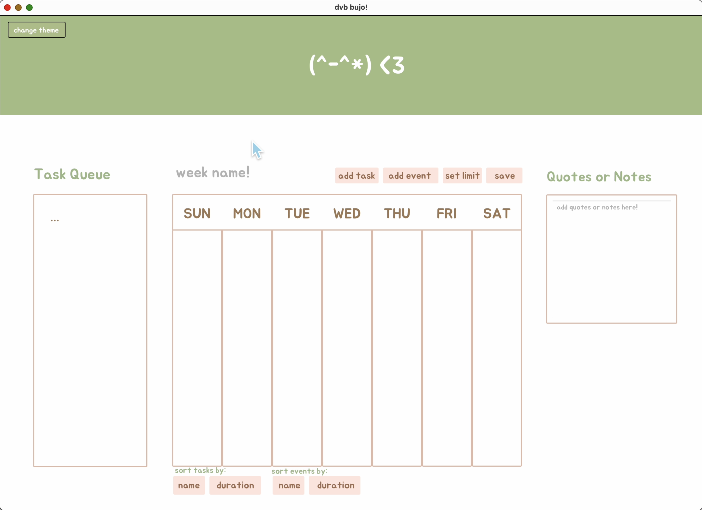
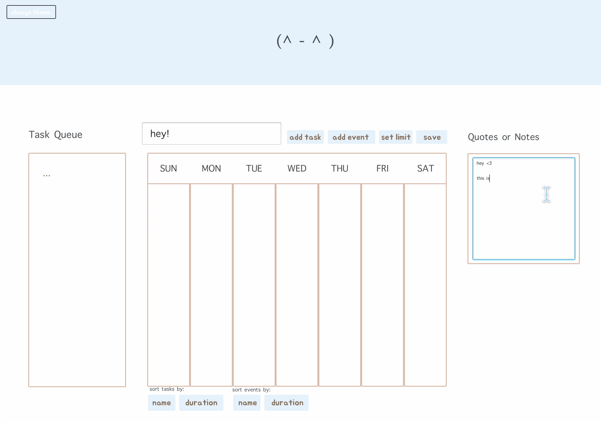
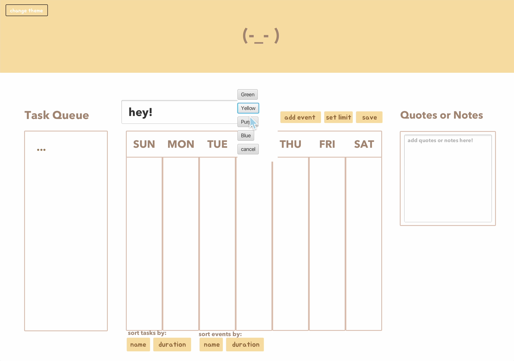
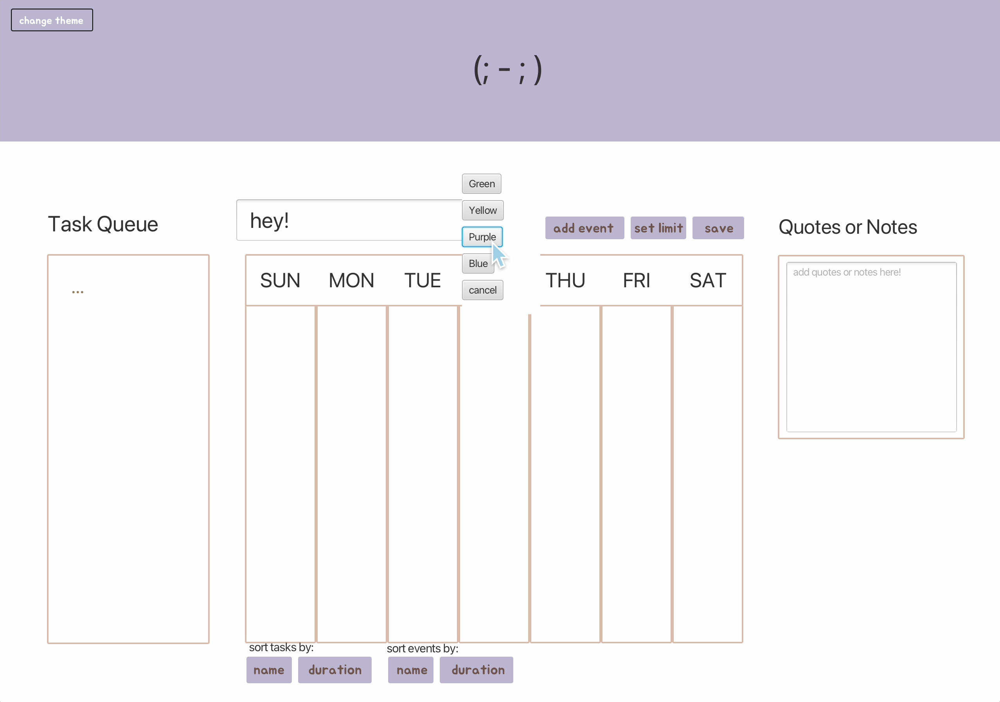

# 3500 PA05 Project Repo

[PA Write Up](https://markefontenot.notion.site/PA-05-8263d28a81a7473d8372c6579abd6481)

# Plan Your Life <3

With plenty of spaces to choose from, display your plans and thoughts as you please! Whether it's your grocery list,
course schedule or to-do list, we have got you covered!

You can even load existing .bujo files!

# SOLID Principles' Applications in our Program

Single Responsibility Principle:

- The classes we created all serve their own individual purposes.
- For example, the BulletJournal class, being one of the main model classes of our program, contains fields that represent the current state of the bullet journal.
- The methods in this class only edit and modify these fields in order to change the state of the bullet journal.
- This class would violate the Single Responsbility Principle if it contained methods that also display its current state in addition to modifying it, which is what our View classes are responsible for.

Open-Closed Principle:

- In addition to the Single Responsibility Principle, our BulletJournal class also adheres to the Open-Closed Principle.
- Our BulletJournal class implements an interface called IBulletJournal.
- The purpose for this interface is so that we can add any neccessary methods that a bullet journal class would have to implement for general functionality.
- Although we don't have any other bullet journal classes in this program, in general the IBulletJournal interface would be the most optimal way in preserving the basic functionality of a bullet journal, while also giving classes that implement it the ability to add varying implementations.

Liskov Substitution Principle:

- Our program did not apply the Liskov Substitution Principle, as we have no classes that extend other classes.

Interface Segregation Principle:

- For interfaces, instead of making 1 big interface for everything bullet-journal-related, we segregated our bullet journal methods into 2 separate interfaces.
- The IBulletJournal interface contains methods that handle the basic functionality of a bullet journal object.
- On the other hand, the BujoReader interface contains methods that handle extracting data from a bullet journal that's been read from a file.
- It's good that we separated these functionalities because even though all of them are related to handling bullet journals, not every class bullet journal object needs to know how to extract data from its file-read version, and not every file reader class needs to know how to change the content of a bullet journal file.

Dependency Inversion Principle:

- In relation to the Open-Closed Principle, the use of our IBulletJournal interface is so that our BulletJournal class won't face errors due to high dependency on something that isn't an interface or abstract class.
- By relying on an interface, our BulletJournal class (and other bullet journal classes) can easily swap and modify their implementations of all the interface's methods that cater to the class's specific needs.
- Doing so reduces coupling and the frequency of issues that arise due to implementation and object changes.

# How We Could Extend Our Program

- From *Section 3: Power Ups* of the features that we didn't choose to implement, we would most likely choose to add a Progress Bar for further extension of our program.
- To visualize the number of tasks completed vs. planned for each day, we would use our pre-existing sorting method that can sort tasks based on their completion status.
- There would be a count variable both part of our DayJson and visualized on the GUI, which would increment and decrement every time a task is added/removed/completed to keep track of the remaining tasks for the day.
- The math for progress bar would be coded so that a percentage of the bar fills up based on the percentage of tasks that have been marked as completed for each day of the week.